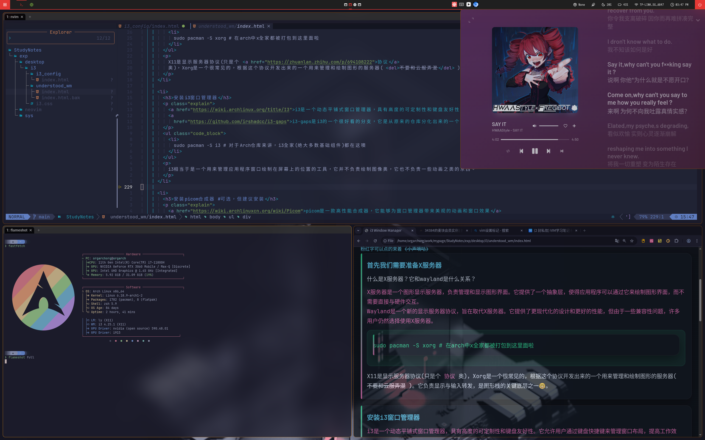

# dotfiles 🤓

效果如图所示:
the effect:

 

安装过程:

- 对于 `i3/` 和 `picom/` 来讲，只需要将配置文件所在目录复制到 `~/.config/` 即可
- 对于polybar
  - 首先`cp -r polybar_themes ~/.config/polybar/`
  - 然后`cd ~/.config/polybar/`
  - 最后`bash setup_fonts.sh`

INSTALLATION:

- as to `i3/` and `picom/` , u only need to copy the directory where the configs is to `~/.config/`
- as to polybar
  1. `cp -r polybar_themes ~/.config/polybar/`
  2. `cd ~/.config/polybar/`
  3. `bash setup_fonts.sh`
